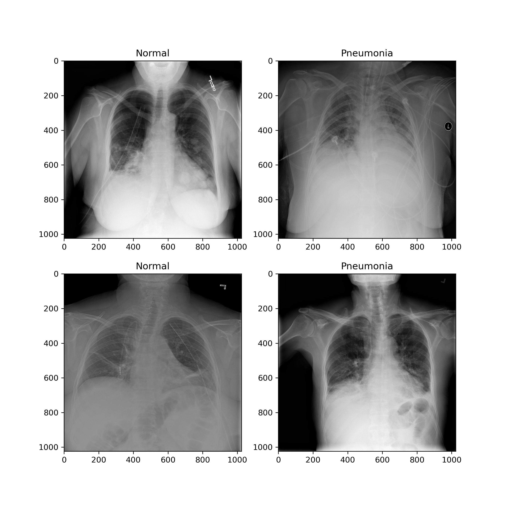
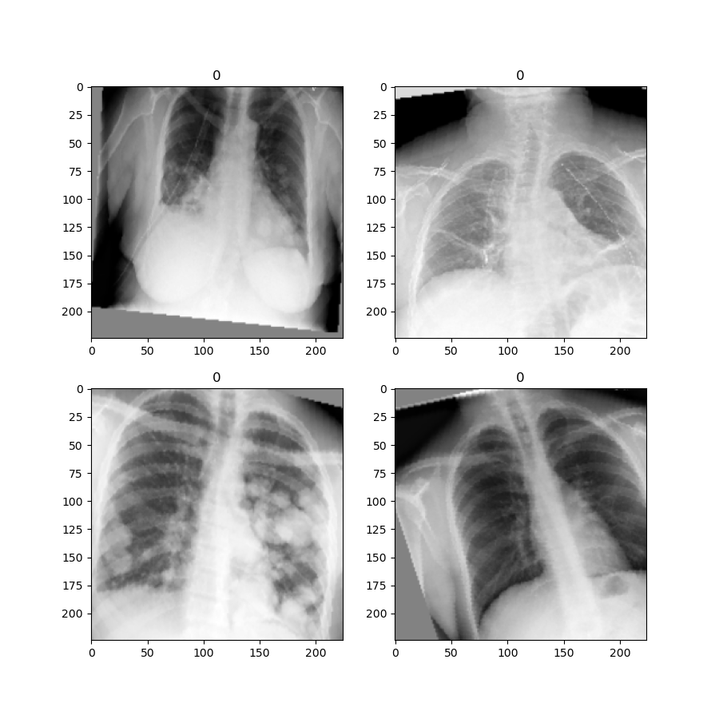
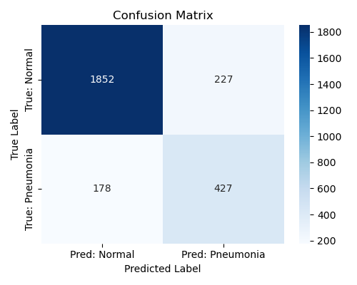
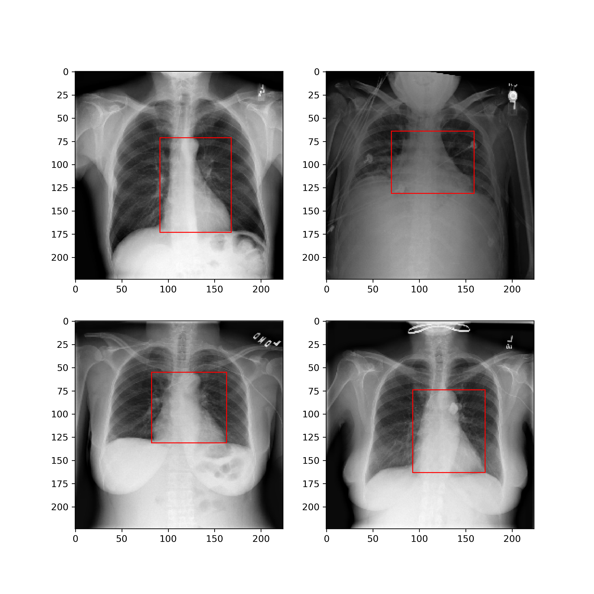
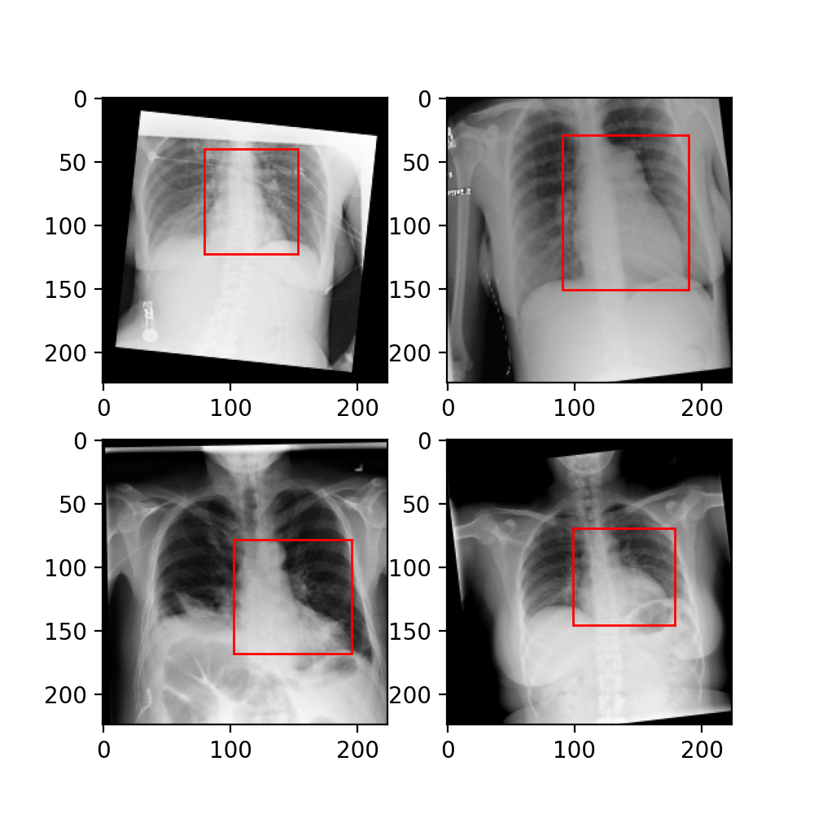
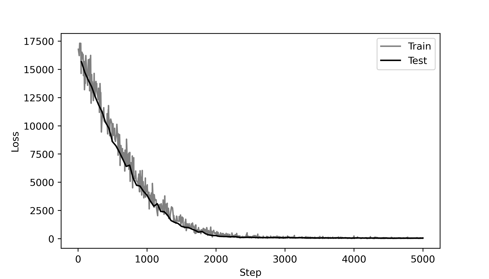
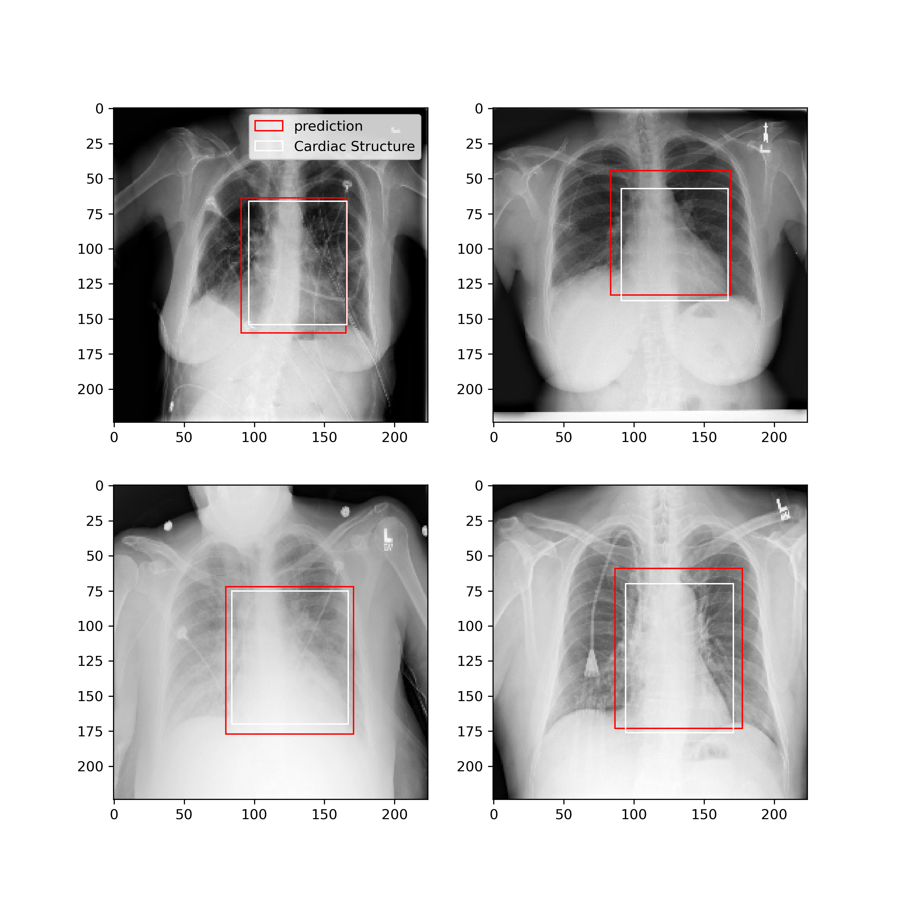

# 🧠 Deep Learning for Medical Image Analysis with PyTorch

This repository contains a series of independent deep learning projects focused on analyzing real-world medical images using PyTorch. The tasks include:

- ✅ **Pneumonia Classification** from chest X-ray images  
- ✅ **Cardiac Structure Detection** in DICOM format  
- ✅ **Atrium Segmentation** in cardiac MRI scans

Each project demonstrates a complete pipeline from data loading and preprocessing (including DICOM handling), to model training, evaluation, and visualization.

## 📁 Project 1 – Pneumonia Classification from Chest X-rays

### 🎯 Goal  
Build a deep learning model that classifies chest X-ray images into **Pneumonia** or **Normal** categories to assist in medical diagnosis.

### 📊 Dataset  
- **Source**: [RSNA Pneumonia Detection Challenge – Kaggle](https://www.kaggle.com/competitions/rsna-pneumonia-detection-challenge/data)  
- **Total Images**: ~26,684 chest X-ray DICOM files  
- **Labels**:  
  - ~6,000 images labeled as pneumonia (`Target = 1`) 
  - ~20,000 labeled as no pneumonia (`Target = 0`)  
- **Format**:  
  - DICOM images (`.dcm`)
    
### 🛠️ What I Did  
- Loaded and visualized DICOM files using `pydicom` and `OpenCV`
  

- Applied **data augmentation** using `torchvision.transforms`:
  - `RandomAffine`: ±15° rotation, ±5% vertical translation, ±10% shear, scaling between 90–110%  
  - `RandomResizedCrop`: crops and resizes to 224×224 with random scale (35% to 100%)  
  - `Normalize`: applied with dataset-specific mean and std  
  - `ToTensor`: converts images to PyTorch tensors
    

- Built a binary classifier using pytorch lightning (fine-tuned `ResNet18`)
- Trained with `BCEWithLogitsLoss` and Adam optimizer
- Evaluated with accuracy and confusion matrix
- Visualized:
  - Training/validation loss and accuracy curves
    
  - Grad-CAM for interpretability
  

### 📉 Results  
Below is an example confusion matrix generated on the test set:

*Confusion matrix of model predictions on the test set*

---

## 📁 Project 2 – Cardiac Structure Detection *(In Progress)*

This project focuses on detecting cardiac structure from DICOM chest xrays.  

### 📊 Dataset  
- **Source**: [RSNA Pneumonia Detection Challenge – Kaggle](https://www.kaggle.com/competitions/rsna-pneumonia-detection-challenge/data)  
- **Total Images**: 496 chest X-ray DICOM files  
- **Labels**:  
  - Images labeled with bounding boxes for cardiac structures  
  - Used 400 images as train dataset and 96 images as validation dataset  
- **Format**:  
  - Images in **DICOM format** (`.dcm`)  
 
---
### 🛠️ What I Did  
- Parsed and visualized bounding box annotations on chest X-rays using `pydicom` and `matplotlib.patches`  
  

- Implemented a **bounding box regression model** using PyTorch Lightning and ResNet18 backbone:
  - Modified the final layer to predict 4 coordinates (x_min, y_min, x_max, y_max)
  - Applied data augmentations that preserve bounding box consistency using `albumentations`:
    - Random contrast, affine transformations 
    

- Trained with **Mean Squared Error Loss** and Adam optimizer  
- Logged and visualized:
  - Training and validation loss curves in TensorBoard
    
  - Predictions overlaid on images for visual inspection  
    

---

### 📉 Results  
Example of ground truth (white) vs. predicted (red) bounding boxes:  

The model successfully learned to detect cardiac structure.

---

## 📁 Project 3 – Atrium Segmentation *(In Progress)*
This project applies deep learning techniques for **2D semantic segmentation of the atrium using cardiac MRI scans and their segmentation maps.

### 📊 Dataset  
- **Source**: [Medical Segmentation Decathlon](http://medicaldecathlon.com/)
- **Total Images**: 20 cardiac MRI scans with ground truth masks  
- **Labels**:  
  - Manual segmentation masks of the **left atrium**  
  - Binary segmentation of the **left atrium** :  `0` = background, `1` = atrium  
- **Format**:  
  - Files are in **NIfTI format** (`.nii.gz`)  

🔧 Implementation and documentation coming soon...

---
## 🧪 Techniques Used

- Convolutional Neural Networks (CNNs)
- DICOM image processing with `pydicom` and `OpenCV`
- Classification, Object Detection, and Semantic Segmentation
- PyTorch deep learning framework

